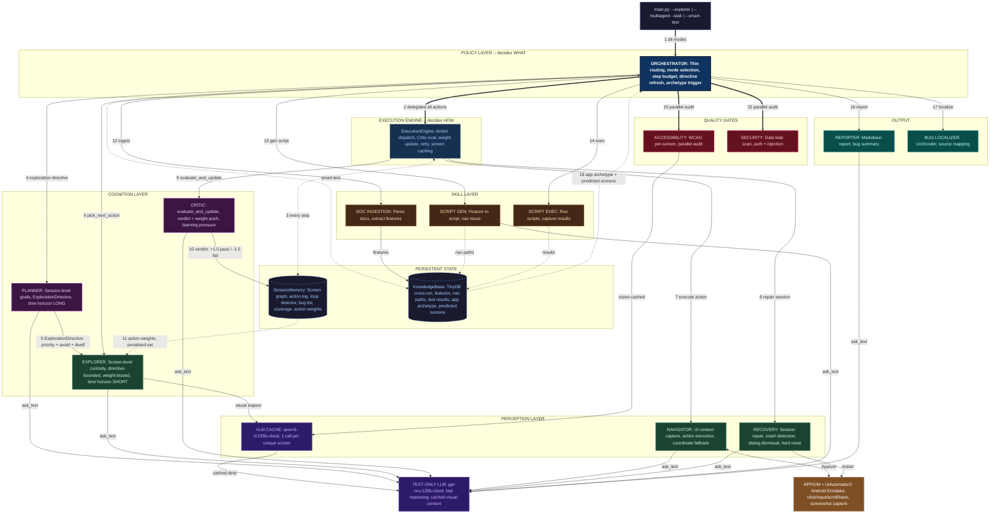

# Dragon Runner -- AI Multi-Agent Mobile Testing System

An autonomous mobile app testing platform powered by **12 specialized AI agents**, vision language models, and Appium. It explores apps, finds visual bugs, audits accessibility/security, and generates structured reports -- all without manual scripting.

---

## Architecture



### Three Intelligence Layers

| Layer | Agents | Time Horizon | Responsibility |
|-------|--------|-------------|----------------|
| **Perception** | Navigator, Recovery, VLM Cache | Immediate | Capture UI state, execute atomic actions, repair failures |
| **Cognition** | Planner, Critic, Explorer | Session / Screen | Planner owns long-term objectives; Explorer owns short-term curiosity within Planner directives; Critic provides learning pressure |
| **Skill** | DocIngestion, ScriptGen, ScriptExec | Feature | Parse docs, generate scripts, execute verifications |

### Key Feedback Loops

| Loop | Mechanism | Effect |
|------|-----------|--------|
| **Critic -> Explorer** | `evaluate_and_update()` pushes verdicts as `ActionWeight` (+1.0 pass, -0.3 warn, -1.5 fail) into SessionMemory | Explorer deprioritises Critic-penalised elements; plans sort by weight |
| **Planner -> Explorer** | `ExplorationDirective` sets priority screens, avoid screens, focus keywords, max screen dwell | Explorer respects session-level strategy; no more oscillation |
| **KnowledgeBase -> Orchestrator** | `detect_app_archetype()` classifies app (ecommerce, login_centric, etc.) and predicts undiscovered screens | Exploration becomes prediction instead of search |
| **Orchestrator -> Engine** | Policy/execution separation via `ExecutionEngine` | Orchestrator routes; Engine dispatches actions, evaluates, records, retries |

### Agent Roles

| # | Agent | Role | Talks To |
|---|-------|------|----------|
| 1 | **Orchestrator** | Policy layer: mode routing, directive refresh, archetype trigger | ExecutionEngine, Planner, all agents |
| 2 | **ExecutionEngine** | Execution layer: action dispatch, Critic eval, weight update, retry | Navigator, Critic, Recovery, SessionMemory |
| 3 | **Explorer** | Screen-level curiosity, directive-bounded, weight-biased plans | Orchestrator, VLM, SessionMemory |
| 4 | **Navigator** | UI action execution, context capture | ExecutionEngine, Appium, LLM |
| 5 | **Recovery** | Session repair, crash dismissal | ExecutionEngine, Appium, LLM |
| 6 | **Planner** | Session-level objectives, ExplorationDirective generation | Orchestrator, LLM |
| 7 | **Critic** | Step evaluation + weight push (learning pressure) | ExecutionEngine, SessionMemory, LLM |
| 8 | **Accessibility** | WCAG audit per screen | Orchestrator, VLM |
| 9 | **Security** | Data leak scan, auth/injection testing | Orchestrator, LLM |
| 10 | **DocIngestion** | Parse docs into features | Orchestrator, KnowledgeBase |
| 11 | **ScriptGenerator** | Feature-to-test-script generation | Orchestrator, KnowledgeBase, LLM |
| 12 | **ScriptExecutor** | Run generated verification scripts | Orchestrator, KnowledgeBase |
| 13 | **Reporter** | Markdown report generation | Orchestrator, LLM |
| -- | **BugLocalizer** | UniXcoder source-level bug mapping | Orchestrator, SessionMemory |

---

## Core Control Loop

```
perception -> reasoning -> action -> evaluation -> adaptation
     |            |           |           |             |
  Navigator    Planner    Navigator    Critic      Explorer
  VLM Cache    Explorer   Engine       Weights     Re-plans
```

This is the **reinforcement learning control loop** implemented with symbolic + LLM reasoning instead of gradient descent. The Critic's weight signal is the reward function; the Explorer's element selection is the policy.

---

## Features

- **Autonomous Exploration** -- discovers screens, plans per-screen strategies, breaks loops with escalating resets
- **Visual Bug Detection** -- VLM-powered screenshot analysis finds layout issues, overlaps, missing images, contrast problems
- **VLM Caching** -- one vision call per unique screen; subsequent calls use fast text-only model with cached context
- **Critic Learning Pressure** -- verdicts become action weights that bias Explorer element selection during the run
- **Planner Directives** -- session-level strategy constrains Explorer curiosity (focus keywords, avoid screens, dwell limits)
- **App Archetype Detection** -- KnowledgeBase classifies app type and predicts undiscovered screens
- **Policy/Execution Separation** -- Orchestrator routes (WHAT); ExecutionEngine dispatches (HOW)
- **Session Crash Recovery** -- auto-detects dead UiAutomator2 sessions and restarts the driver transparently
- **Accessibility Auditing** -- WCAG-based scoring on every discovered screen (parallel, end-of-session)
- **Security Scanning** -- data leak detection, auth screen testing, injection input generation
- **Smart Test Mode** -- ingests app documentation, extracts features, generates and executes verification scripts
- **Task Mode** -- natural language commands ("Login with bob@example.com") decomposed into executable plans
- **Cross-Run Memory** -- TinyDB knowledge base persists features, navigation paths, test results across sessions
- **Bug Localization** -- UniXcoder-based source code mapping for detected bugs
- **Structured Reports** -- Markdown reports with bugs, screenshots, coverage analysis, and recommendations

---

## Installation

```bash
cd python_agent
pip install -r requirements.txt
```

### Requirements

| Dependency | Version |
|------------|---------|
| Python | 3.10+ |
| Appium Server | 2.x |
| UiAutomator2 Driver | latest |
| Android Emulator/Device | API 28+ |
| Ollama | with vision + text models |

---

## Usage

### Explorer Mode (Autonomous Bug Finding)

```bash
# Default 80-step exploration
python -m python_agent.main --explorer --max-steps 80

# Quick smoke test
python -m python_agent.main --explorer --max-steps 20
```

The explorer will:
1. Launch the app and generate a **Planner directive** (session-level strategy)
2. Capture the initial screen and create a **weight-biased screen plan**
3. Execute actions via the **ExecutionEngine**, which evaluates each via the **Critic**
4. Critic verdicts flow as **action weights** back into Explorer's element prioritisation
5. Detect **app archetype** after 6+ screens (predict undiscovered screens)
6. **Refresh directive** every 20 steps (re-assess coverage, shift focus)
7. Break **action loops** with escalating strategies (menu nav -> force-click -> app reset)
8. Run **accessibility + security audits** in parallel at session end
9. Generate a **Markdown report** with all bugs, scores, and recommendations

### Task Mode (Natural Language)

```bash
python -m python_agent.main --multiagent --task "Login with bob@example.com / 10203040"

python -m python_agent.main --multiagent --task "Add the first product to cart and verify the cart badge shows 1"
```

### Smart Test Mode (Doc-Driven)

```bash
# With documentation
python -m python_agent.main --smart-test --docs path/to/docs/

# Without docs (auto-generates features from UI)
python -m python_agent.main --smart-test
```

### Static Workflow Tests

```bash
python -m python_agent.main --workflow workflows/comprehensive_test_scenarios.json --vision
```

---

## Configuration

Edit `python_agent/config.py`:

```python
APP_PACKAGE = "com.saucelabs.mydemoapp.rn"
APP_ACTIVITY = ".MainActivity"
APPIUM_HOST = "http://127.0.0.1:4723/wd/hub"
OLLAMA_HOST = "http://localhost:11434"
```

### LLM Models

| Purpose | Model | Config Key |
|---------|-------|------------|
| Vision (screenshots) | `qwen3-vl:235b-cloud` | `VISION_CLOUD_MODELS` |
| Text reasoning | `gpt-oss:120b-cloud` | `TEXT_CLOUD_MODELS` |

---

## Project Structure

```
python_agent/
├── main.py                  # CLI entry point
├── config.py                # All configuration
├── appium_controller.py     # Appium driver wrapper
├── vlm.py                   # VLM/LLM + caching layer
├── session_memory.py        # Crash-resilient state + action weights
├── navigation_memory.py     # Screen graph for navigation
├── knowledge_base.py        # TinyDB cross-run memory + archetype detection
├── ui_extract.py            # XML page source parsing
├── logging_config.py        # Rotating file + console logging
├── agents/
│   ├── base.py              # BaseAgent with LLM/VLM interface
│   ├── orchestrator.py      # Policy layer (thin routing)
│   ├── execution_engine.py  # Execution layer (dispatch + eval + record)
│   ├── explorer.py          # Curiosity-driven exploration (directive-bounded)
│   ├── navigator.py         # Action execution
│   ├── recovery.py          # Session repair
│   ├── planner.py           # Session strategy + ExplorationDirective
│   ├── critic.py            # Evaluation + weight feedback
│   ├── accessibility.py     # WCAG auditing
│   ├── security.py          # Security scanning
│   ├── reporter.py          # Markdown report generation
│   ├── doc_ingestion.py     # Documentation parsing
│   ├── script_generator.py  # Test script generation
│   └── script_executor.py   # Test script execution
├── bug_localization/
│   ├── bug_localizer.py     # UniXcoder bug-to-source mapping
│   ├── gui_data_extractor.py
│   ├── preprocessor.py
│   └── unixcoder.py
├── workflows/               # JSON test scenario files
└── artifacts/
    ├── logs/                # Rotating agent.log
    ├── reports/             # JSON + Markdown reports
    ├── screenshots/         # Per-step screenshots
    └── knowledge_base.db.json  # TinyDB cross-run memory
```

---

## Sample Run Results

| Metric | Value |
|--------|-------|
| Steps completed | **80 / 80** |
| Unique screens discovered | **18** |
| Visual bugs found | **4** |
| Session crashes auto-recovered | **3** |
| VLM cache hit rate | **46%** |
| Screens accessibility-audited | **21** |
| Run time | **~30 min** |

### Bugs Found (Example)

| ID | Severity | Description |
|----|----------|-------------|
| 1 | Medium | Duplicate validation messages on URL input |
| 2 | **High** | Premature validation fires on placeholder text |
| 3 | Medium | Toast notification overlaps interactive buttons |
| 4 | Low | Disabled button has poor contrast (fails WCAG-AA) |

---

## App Archetype Detection

After 6+ screens are discovered, the KnowledgeBase analyses all element IDs against 6 archetype signal sets:

| Archetype | Signal Keywords |
|-----------|----------------|
| **ecommerce** | cart, checkout, price, product, catalog, shipping |
| **login_centric** | login, sign in, register, password, forgot password |
| **media_browser** | video, play, gallery, photo, camera, stream |
| **form_enterprise** | form, submit, dropdown, date picker, upload, table |
| **social** | feed, post, like, comment, share, follow, message |
| **navigation_heavy** | map, location, directions, gps, nearby, route |

The detected archetype **predicts undiscovered screens** (e.g. ecommerce app with no "checkout" screen found yet), turning exploration from search into anticipation.

---

## Workflow JSON Format

```json
{
  "version": 1,
  "data": { "username": "bob@example.com", "password": "10203040" },
  "workflows": [
    {
      "name": "Login Flow",
      "priority": "critical",
      "steps": [
        { "action": "click", "locator_strategy": "accessibility_id", "locator_value": "Login button" },
        { "action": "input", "locator_strategy": "accessibility_id", "locator_value": "Username input field", "text": "${username}" },
        { "action": "scroll", "direction": "down" },
        { "action": "visual_check", "note": "Check for UI bugs" },
        { "action": "assert_contains", "assert_contains": "Welcome" }
      ]
    }
  ]
}
```

### Supported Actions

| Action | Description | Parameters |
|--------|-------------|------------|
| `click` | Tap an element | `locator_strategy`, `locator_value` |
| `input` | Type text into a field | `locator_strategy`, `locator_value`, `text` |
| `scroll` | Scroll in a direction | `direction` (up/down/left/right) |
| `long_press` | Long-press an element | `locator_strategy`, `locator_value` |
| `back` | Press Android back button | -- |
| `wait` | Pause execution | `seconds` |
| `visual_check` | VLM screenshot analysis | `note` |
| `assert_contains` | Assert text is visible | `assert_contains` |
| `reset` | Reset app state | -- |

### Locator Strategies

| Strategy | Example |
|----------|---------|
| `accessibility_id` | `"Login button"` |
| `resource_id` | `"com.app:id/btn_login"` |
| `text` | `"Sign In"` |
| `xpath` | `"//android.widget.Button[@text='OK']"` |

---

## License

MIT
