# Dragon Runner -- AI Multi-Agent Mobile Testing System

An autonomous mobile app testing platform powered by **12 specialized AI agents**, vision language models, and Appium. It explores apps, finds visual bugs, audits accessibility/security, and generates structured reports -- all without manual scripting.

---

## Architecture

```mermaid
flowchart TB
    classDef entry fill:#1a1a2e,color:#e0e0ff,stroke:#4a4a8a,stroke-width:2px
    classDef orch fill:#0f3460,color:#fff,stroke:#16213e,stroke-width:3px,font-weight:bold
    classDef storage fill:#1a1a2e,color:#a0cfff,stroke:#3a6ea5,stroke-width:2px,stroke-dasharray:5
    classDef explore fill:#1b4332,color:#d8f3dc,stroke:#2d6a4f,stroke-width:2px
    classDef plan fill:#3c1642,color:#e8d5f5,stroke:#7b2d8e,stroke-width:2px
    classDef smart fill:#432818,color:#ffe0b2,stroke:#8d5524,stroke-width:2px
    classDef quality fill:#641220,color:#ffd6d6,stroke:#a4133c,stroke-width:2px
    classDef output fill:#0a4d4a,color:#c5fff8,stroke:#12776e,stroke-width:2px
    classDef llm fill:#2d1b69,color:#c9b1ff,stroke:#5c3d99,stroke-width:2px
    classDef device fill:#7f4f24,color:#fff,stroke:#b08968,stroke-width:2px

    CLI["main.py\n━━━━━━━━━━━━━\n--explorer\n--multiagent --task\n--smart-test"]:::entry

    CLI ==>|"all modes"| ORCH

    ORCH["ORCHESTRATOR\n━━━━━━━━━━━━━━━━━━━━━━━━\nCentral coordinator\nMode routing | Step loop\nScreen caching | Bug recording"]:::orch

    MEM[("SessionMemory\n──────────\nScreen graph\nAction log\nLoop detector\nBug list\nCoverage")]:::storage
    KB[("KnowledgeBase\n──────────\nTinyDB\nFeatures\nNav paths\nTest results\nCross-run")]:::storage

    ORCH <-.->|"every step"| MEM
    ORCH <-.->|"smart-test mode"| KB

    EXP["EXPLORER\n━━━━━━━━━━━━━━━━━\nScreen planning\nVisual inspection\nLoop breaking\nElement priority\nApp reset trigger"]:::explore

    NAV["NAVIGATOR\n━━━━━━━━━━━━━━━━━\nUI context capture\nAction execution\nCoordinate fallback\nSafe input strategy"]:::explore

    REC["RECOVERY\n━━━━━━━━━━━━━━━━━\nSession repair\nCrash detection\nDialog dismissal\nLLM-guided fix\nHard reset"]:::explore

    PLAN["PLANNER\n━━━━━━━━━━━━━\nGoal decomposition\nTask sequencing\nLLM plan gen"]:::plan

    CRIT["CRITIC\n━━━━━━━━━━━━━\nStep evaluation\nPass/fail verdict\nRetry guidance"]:::plan

    DOC["DOC INGESTION\n━━━━━━━━━━━━━━━━\nParse docs\nExtract features\nPriority ranking"]:::smart

    SGEN["SCRIPT GEN\n━━━━━━━━━━━━━━━━\nFeature to script\nNav script reuse\nVerification logic"]:::smart

    SEXE["SCRIPT EXEC\n━━━━━━━━━━━━━━━━\nRun scripts\nCapture results\nReport status"]:::smart

    A11Y["ACCESSIBILITY\n━━━━━━━━━━━━━━━━━━\nWCAG audit\nPer-screen scoring\nIssue classification"]:::quality

    SEC["SECURITY\n━━━━━━━━━━━━━━━━━━\nData leak scan\nAuth testing\nInjection inputs\nRisk assessment"]:::quality

    REP["REPORTER\n━━━━━━━━━━━\nMarkdown report\nBug summary\nRecommendations"]:::output

    BUG["BUG LOCALIZER\n━━━━━━━━━━━━━━\nUniXcoder analysis\nSource mapping\nRoot cause hints"]:::output

    VLM["VLM CACHE + VISION\n━━━━━━━━━━━━━━━━━━━━━━━━━\nqwen3-vl:235b-cloud\n1 call per unique screen\nRetry on failure"]:::llm

    TXT["TEXT-ONLY LLM\n━━━━━━━━━━━━━━━━━━━━━\ngpt-oss:120b-cloud\nFast reasoning\nUses cached visual context\nFallback for VLM errors"]:::llm

    DEVICE["APPIUM + UiAutomator2\n━━━━━━━━━━━━━━━━━━━━━━━━━\nAndroid Emulator\nClick / Input / Scroll / Back\nScreenshot capture"]:::device

    ORCH -->|"pick_next_action\nplan_for_new_screen"| EXP
    ORCH -->|"execute_action_direct"| NAV
    ORCH -->|"repair / recover"| REC
    ORCH -->|"generate plan"| PLAN
    ORCH -->|"evaluate step"| CRIT
    ORCH -->|"ingest docs"| DOC
    ORCH -->|"gen script"| SGEN
    ORCH -->|"exec script"| SEXE
    ORCH ==>|"parallel audit\n(ThreadPoolExecutor)"| A11Y
    ORCH ==>|"parallel audit\n(ThreadPoolExecutor)"| SEC
    ORCH -->|"generate report"| REP
    ORCH -->|"analyze bug"| BUG

    NAV <-->|"Appium commands"| DEVICE
    REC -->|"restart driver"| DEVICE

    EXP -->|"visual inspect\nscreen analysis"| VLM
    A11Y -->|"vision-cached audit"| VLM
    VLM -->|"cached desc + prompt"| TXT
    PLAN & CRIT & REC -->|"ask_text()"| TXT
    SGEN & SEXE -->|"ask_text()"| TXT
    NAV -->|"resolve action (task mode)"| TXT
    REP -->|"ask_text()"| TXT

    DOC -->|"features"| KB
    SGEN -.->|"reuse nav paths"| KB
    SEXE -.->|"store results"| KB
    EXP -.->|"loop check / screen graph"| MEM
```



### Agent Roles

| # | Agent | Role | Talks To |
|---|-------|------|----------|
| 1 | **Orchestrator** | Central coordinator, mode routing, step loop | All agents |
| 2 | **Explorer** | Screen planning, visual inspection, loop breaking | Orchestrator, VLM, SessionMemory |
| 3 | **Navigator** | UI action execution, context capture | Orchestrator, Appium, LLM |
| 4 | **Recovery** | Session repair, crash dismissal | Orchestrator, Appium, LLM |
| 5 | **Planner** | Goal decomposition, task sequencing | Orchestrator, LLM |
| 6 | **Critic** | Step evaluation, pass/fail verdicts | Orchestrator, LLM |
| 7 | **Accessibility** | WCAG audit per screen | Orchestrator, VLM |
| 8 | **Security** | Data leak scan, auth/injection testing | Orchestrator, LLM |
| 9 | **DocIngestion** | Parse docs into features | Orchestrator, KnowledgeBase |
| 10 | **ScriptGenerator** | Feature-to-test-script generation | Orchestrator, KnowledgeBase, LLM |
| 11 | **ScriptExecutor** | Run generated verification scripts | Orchestrator, KnowledgeBase |
| 12 | **Reporter** | Markdown report generation | Orchestrator, LLM |
| -- | **BugLocalizer** | UniXcoder source-level bug mapping | Orchestrator, SessionMemory |

---

## Features

- **Autonomous Exploration** -- discovers screens, plans per-screen strategies, breaks loops with escalating resets
- **Visual Bug Detection** -- VLM-powered screenshot analysis finds layout issues, overlaps, missing images, contrast problems
- **VLM Caching** -- one vision call per unique screen; subsequent calls use fast text-only model with cached context
- **Session Crash Recovery** -- auto-detects dead UiAutomator2 sessions and restarts the driver transparently
- **Accessibility Auditing** -- WCAG-based scoring on every discovered screen (parallel, end-of-session)
- **Security Scanning** -- data leak detection, auth screen testing, injection input generation
- **Smart Test Mode** -- ingests app documentation, extracts features, generates and executes verification scripts
- **Task Mode** -- natural language commands ("Login with bob@example.com") decomposed into executable plans
- **Cross-Run Memory** -- TinyDB knowledge base persists features, navigation paths, test results across sessions
- **Bug Localization** -- UniXcoder-based source code mapping for detected bugs
- **Structured Reports** -- Markdown reports with bugs, screenshots, coverage analysis, and recommendations

---

## Installation

```bash
cd python_agent
pip install -r requirements.txt
```

### Requirements

| Dependency | Version |
|------------|---------|
| Python | 3.10+ |
| Appium Server | 2.x |
| UiAutomator2 Driver | latest |
| Android Emulator/Device | API 28+ |
| Ollama | with vision + text models |

---

## Usage

### Explorer Mode (Autonomous Bug Finding)

```bash
# Default 80-step exploration
python -m python_agent.main --explorer --max-steps 80

# Quick smoke test
python -m python_agent.main --explorer --max-steps 20
```

The explorer will:
1. Launch the app and capture the initial screen
2. Create a **screen plan** prioritising navigation > actions > other elements
3. Execute actions, detect screen changes, and **replan** on every new screen
4. Run **visual inspection** (VLM) on each unique screen
5. Detect and break **action loops** with escalating strategies (menu nav -> force-click -> app reset)
6. Run **accessibility + security audits** in parallel at session end
7. Generate a **Markdown report** with all bugs, scores, and recommendations

### Task Mode (Natural Language)

```bash
python -m python_agent.main --multiagent --task "Login with bob@example.com / 10203040"

python -m python_agent.main --multiagent --task "Add the first product to cart and verify the cart badge shows 1"
```

### Smart Test Mode (Doc-Driven)

```bash
# With documentation
python -m python_agent.main --smart-test --docs path/to/docs/

# Without docs (auto-generates features from UI)
python -m python_agent.main --smart-test
```

### Static Workflow Tests

```bash
python -m python_agent.main --workflow workflows/comprehensive_test_scenarios.json --vision
```

---

## Configuration

Edit `python_agent/config.py`:

```python
APP_PACKAGE = "com.saucelabs.mydemoapp.rn"
APP_ACTIVITY = ".MainActivity"
APPIUM_HOST = "http://127.0.0.1:4723/wd/hub"
OLLAMA_HOST = "http://localhost:11434"
```

### LLM Models

| Purpose | Model | Config Key |
|---------|-------|------------|
| Vision (screenshots) | `qwen3-vl:235b-cloud` | `VISION_CLOUD_MODELS` |
| Text reasoning | `gpt-oss:120b-cloud` | `TEXT_CLOUD_MODELS` |

---

## Project Structure

```
python_agent/
├── main.py                  # CLI entry point
├── config.py                # All configuration
├── appium_controller.py     # Appium driver wrapper
├── vlm.py                   # VLM/LLM + caching layer
├── session_memory.py        # Crash-resilient state persistence
├── navigation_memory.py     # Screen graph for navigation
├── ui_extract.py            # XML page source parsing
├── logging_config.py        # Rotating file + console logging
├── agents/
│   ├── base.py              # BaseAgent with LLM/VLM interface
│   ├── orchestrator.py      # Central coordinator
│   ├── explorer.py          # Curiosity-driven exploration
│   ├── navigator.py         # Action execution
│   ├── recovery.py          # Session repair
│   ├── planner.py           # Task plan generation
│   ├── critic.py            # Step evaluation
│   ├── accessibility.py     # WCAG auditing
│   ├── security.py          # Security scanning
│   ├── reporter.py          # Markdown report generation
│   ├── doc_ingestion.py     # Documentation parsing
│   ├── script_generator.py  # Test script generation
│   └── script_executor.py   # Test script execution
├── bug_localization/
│   ├── bug_localizer.py     # UniXcoder bug-to-source mapping
│   ├── gui_data_extractor.py
│   ├── preprocessor.py
│   └── unixcoder.py
├── workflows/               # JSON test scenario files
└── artifacts/
    ├── logs/                # Rotating agent.log
    ├── reports/             # JSON + Markdown reports
    ├── screenshots/         # Per-step screenshots
    └── knowledge_base.db.json  # TinyDB cross-run memory
```

---

## Sample Run Results

| Metric | Value |
|--------|-------|
| Steps completed | **80 / 80** |
| Unique screens discovered | **18** |
| Visual bugs found | **4** |
| Session crashes auto-recovered | **3** |
| VLM cache hit rate | **46%** |
| Screens accessibility-audited | **21** |
| Run time | **~30 min** |

### Bugs Found (Example)

| ID | Severity | Description |
|----|----------|-------------|
| 1 | Medium | Duplicate validation messages on URL input |
| 2 | **High** | Premature validation fires on placeholder text |
| 3 | Medium | Toast notification overlaps interactive buttons |
| 4 | Low | Disabled button has poor contrast (fails WCAG-AA) |

---

## Workflow JSON Format

```json
{
  "version": 1,
  "data": { "username": "bob@example.com", "password": "10203040" },
  "workflows": [
    {
      "name": "Login Flow",
      "priority": "critical",
      "steps": [
        { "action": "click", "locator_strategy": "accessibility_id", "locator_value": "Login button" },
        { "action": "input", "locator_strategy": "accessibility_id", "locator_value": "Username input field", "text": "${username}" },
        { "action": "scroll", "direction": "down" },
        { "action": "visual_check", "note": "Check for UI bugs" },
        { "action": "assert_contains", "assert_contains": "Welcome" }
      ]
    }
  ]
}
```

### Supported Actions

| Action | Description | Parameters |
|--------|-------------|------------|
| `click` | Tap an element | `locator_strategy`, `locator_value` |
| `input` | Type text into a field | `locator_strategy`, `locator_value`, `text` |
| `scroll` | Scroll in a direction | `direction` (up/down/left/right) |
| `long_press` | Long-press an element | `locator_strategy`, `locator_value` |
| `back` | Press Android back button | -- |
| `wait` | Pause execution | `seconds` |
| `visual_check` | VLM screenshot analysis | `note` |
| `assert_contains` | Assert text is visible | `assert_contains` |
| `reset` | Reset app state | -- |

### Locator Strategies

| Strategy | Example |
|----------|---------|
| `accessibility_id` | `"Login button"` |
| `resource_id` | `"com.app:id/btn_login"` |
| `text` | `"Sign In"` |
| `xpath` | `"//android.widget.Button[@text='OK']"` |

---

## License

MIT
